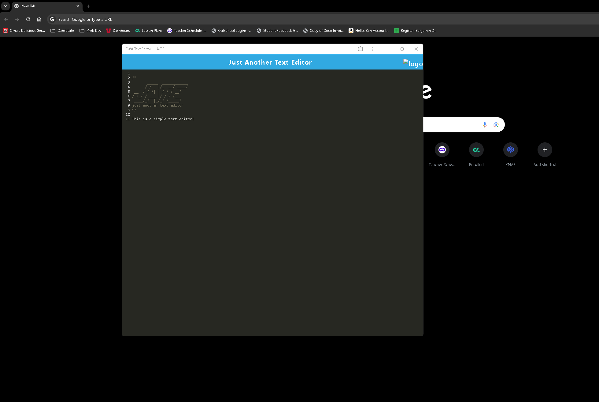

# PWA Text Editor

## Description

A simple text editor that can be downloaded from the browser

## Installation

Open the terminal and use npm run install, npm run build, and npm run start:dev

## Usage

    ```md
    
    ```


## License

MIT
